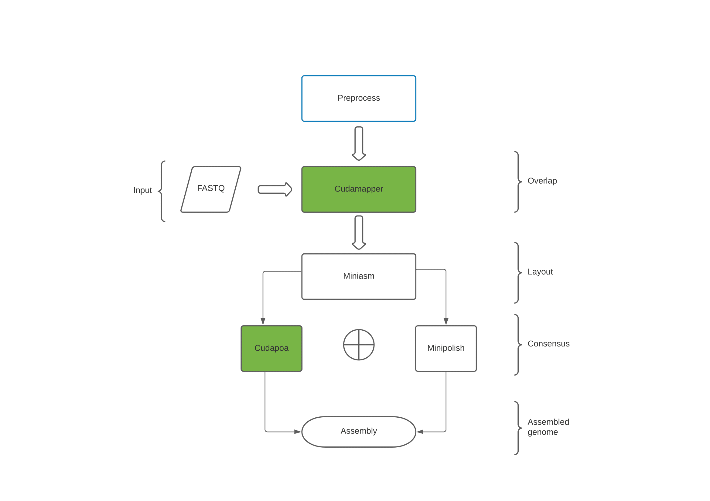

# GPU-Accelerated-de-novo-assembly

## Table of contents

* [Introduction](#introduction)
* [Requirements](#requirements)
* [GPU-platforms](#gpu-platforms)
* [Method](#method)
* [Quick usage](#quick-usage)
* [Full usage](#full-usage)
* [License](#license)

## Introduction

## Requirements

* [Cudamapper](https://github.com/clara-parabricks/GenomeWorks)
* [Miniasm](https://github.com/lh3/miniasm) 
* [Minipolish](https://github.com/rrwick/Minipolish)
* [minimap2](https://github.com/lh3/minimap2)
* [Racon](https://github.com/isovic/racon)
* [Cudapoa](https://github.com/clara-parabricks/GenomeWorks)

## GPU-Platforms 

#### Jetson nano

#### Geforce RTX 2070

## License

[MIT License](https://choosealicense.com/licenses/mit/)
